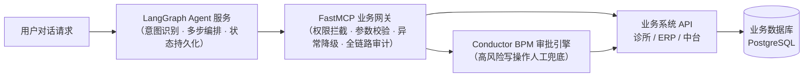
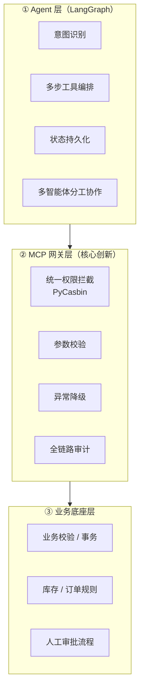
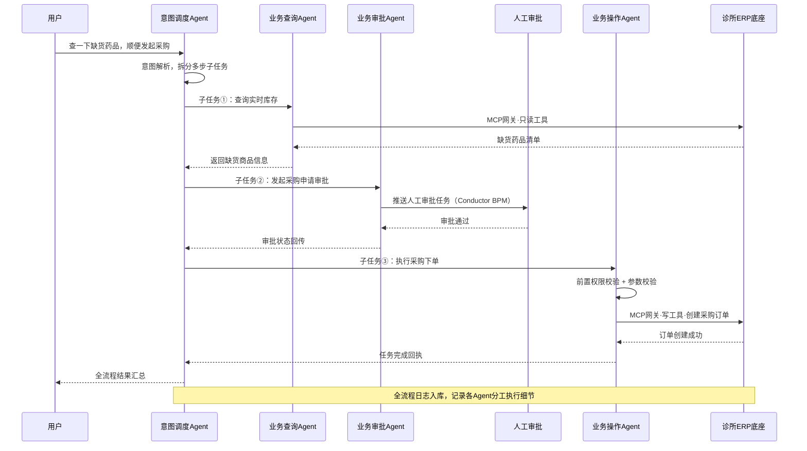

# 🧠 Nautilus Agent Platform — 企业级安全可控 AI Agent 业务中台

<p align="center">
  
  
  
  
  
  
  
  
  
</p>

> 面向传统业务系统的**企业级安全可控 AI Agent 平台**。区别于普通对话 Demo，真正解决企业落地 LLM 业务的核心痛点：**大模型幻觉越权、业务数据篡改风险、缺少审批流程、无审计日志、多业务系统对接混乱**。
>
> 平台基于 Python 技术栈构建企业智能体，通过 **MCP 统一业务网关**对接传统业务系统（医疗诊所系统、进销存 ERP、通用业务中台），结合 **BPM 人工审批、RBAC 权限隔离、全链路审计**，实现安全可控的业务智能体。同时自研 **Node.js CLI 脚手架**，一键生成企业级 Agent 工程模板。
>
> **定位：可落地、可工程化、符合互联网大厂 ToB AI 应用开发规范。**

---

## 📑 目录

- [一、项目简介](#一项目简介)
- [二、技术栈](#二技术栈)
- [三、整体架构](#三整体架构)
- [四、核心功能亮点](#四核心功能亮点)
- [五、多智能体协作架构](#五多智能体协作架构)
- [六、快速开始](#六快速开始)
- [七、项目结构](#七项目结构)
- [八、开发规范体系](#八开发规范体系)
- [九、项目优势总结](#九项目优势总结面试官视角)
- [十、后续扩展方向](#十后续扩展方向)
- [十一、开源协议](#十一开源协议)

---

## 一、项目简介

企业将 LLM 引入真实业务时，直接让大模型调用业务接口是不可行的：

| 企业落地痛点 | 本平台解决方案 |
|---|---|
| 大模型幻觉导致越权查询、误改数据 | 三层安全架构，Agent 层零业务权限 |
| 写操作无审批，出事无法追责 | 高风险写操作强制 Conductor BPM 人工审批 |
| 异构业务系统 API 混乱，对接成本高 | MCP 标准化网关统一协议封装 |
| 无审计日志，合规审查无法通过 | 全链路审计：指令/推理/入参/出参/身份 |
| Agent 权限过大，无法最小化控制 | PyCasbin 为每个 Agent 独立授权 |

平台以 **Nautilus Clinic 诊所管理系统**（本项目自带的真实业务系统，基于 Spring Boot 3 + PostgreSQL JSONB）为医疗行业业务底座，实现「对话 → 查询 → 审批 → 写入」的完整企业业务闭环，并可无缝扩展对接 JSH-ERP（进销存）、NocoBase（通用业务中台）等其他行业底座。

---

## 二、技术栈

| 层次 | 技术 |
|---|---|
| AI 智能体层 | Python、FastAPI、LangGraph、LangSmith |
| 标准化工具网关 | FastMCP、PyCasbin 权限治理 |
| 企业工作流审批 | Netflix Conductor-OSS |
| 传统业务底座 | **Nautilus Clinic（医疗诊所系统）**、JSH-ERP（进销存）、NocoBase（通用业务中台） |
| 工程化工具 | Node.js CLI 脚手架、Docker、Docker Compose |
| 数据存储 | PostgreSQL |
| 规范体系 | 容器化开发、统一代码规范、Git 分支规范、日志审计规范 |

---

## 三、整体架构

### 3.1 端到端链路



### 3.2 三层安全架构（核心亮点）



1. **Agent 层**：负责意图识别、多步工具编排、状态持久化，**不处理任何业务规则**；
2. **MCP 网关层**：统一权限拦截、参数校验、异常降级、全链路审计（核心创新）；
3. **业务底座层**：业务校验、事务、库存/订单规则、人工审批流程，完全下沉。

> 关键原则：**大模型永远不直接触达业务数据库**，一切调用必经网关，一切写入必经审批。

---

## 四、核心功能亮点（面试必问·高分亮点）

| # | 亮点 | 说明 |
|---|---|---|
| 1 | **企业安全可控 Agent** | 区分只读工具 / 高风险写工具，杜绝大模型幻觉篡改业务数据 |
| 2 | **MCP 标准化网关** | 异构业务系统 API 统一协议封装，解耦 Agent 与业务系统 |
| 3 | **最小权限体系** | 基于 PyCasbin 给 Agent 独立角色、独立权限，防止越权 |
| 4 | **人工兜底审批** | 所有写操作强制 Conductor BPM 审批，企业生产级设计 |
| 5 | **全链路审计日志** | 记录用户指令、Agent 推理、工具入参、返回结果、操作身份 |
| 6 | **自研脚手架** | Node.js CLI 一键生成企业级 Agent 工程，内置多行业业务模板 |
| 7 | **容器化统一开发环境** | 全服务 Docker 编排，团队环境一致、开箱即用 |

---

## 五、多智能体协作架构

针对单 Agent 无法处理复杂串联业务、跨模块协同业务的痛点，平台迭代实现**专业化分工多智能体架构**：按业务职责拆分专属智能体，各司其职、协同联动、互不干扰。

### 5.1 智能体角色拆分（企业业务适配）

| 角色 | 职责 | 权限边界 |
|---|---|---|
| **意图调度 Agent**（总控节点） | 用户意图解析、任务分发、全局流程编排、异常兜底；不处理具体业务，仅做任务调度与状态统筹，是多智能体的核心中枢 | 无业务工具权限 |
| **业务查询 Agent** | 专职只读业务：查询药品库存、患者档案、就诊记录、订单、工单进度等 | 仅只读 MCP 工具，零数据修改权限 |
| **业务审批 Agent** | 专职企业风控流程：发起 Conductor 审批、查询审批状态、推送通知、处理审批通过/驳回后的联动 | 仅审批类工具 |
| **业务操作 Agent** | 专职高风险业务操作：仅承接调度 Agent 分发的合规任务，前置权限校验 + 参数校验，严格遵循「审批通过后执行业务写入」 | 写工具 + BPM 校验 |

### 5.2 核心技术实现方案

- **状态共享机制**：基于 LangGraph 全局状态池实现多 Agent 状态互通，统一存储用户上下文、任务进度、工具调用记录、审批状态，避免信息割裂、重复调用工具；
- **任务分发策略**：规则 + 大模型双驱动分发——简单意图规则精准分发，复杂跨模块意图由大模型拆分多子任务，串行/并行分发给对应专属 Agent；
- **Agent 权限隔离**：基于 PyCasbin 为每个独立智能体配置专属权限策略，严格限制可调用的 MCP 工具与可操作的业务数据，杜绝跨角色越权；
- **任务容错与重试**：单节点失败重试、失败熔断、任务回滚机制，单个子 Agent 故障不影响整体主流程；
- **全链路协同审计**：审计日志新增智能体 ID、任务链路 ID，完整记录多 Agent 分工、调用时序、任务流转过程，实现协同链路全溯源。

### 5.3 落地业务场景（完整业务闭环）

复杂业务场景：用户发起**「查询库存不足 → 申请采购 → 等待审批 → 审批通过自动创建采购订单」**全流程（以药品库存为例）。



### 5.4 多智能体差异化优势

- 区别于市面简单对话多 Agent Demo，实现**企业业务级分工协作**，解决复杂串联业务落地难题；
- 通过 Agent 职责解耦、权限隔离，大幅提升复杂业务执行**稳定性与安全性**，贴合大厂生产级设计思想；
- 架构**可无限扩展**，可快速新增报表 Agent、工单 Agent、对账 Agent 等专属角色，适配更多企业业务场景；
- 完善的**协同链路追踪与容错机制**，解决多智能体协同常见的任务混乱、状态不一致、单点故障问题。

---

## 六、快速开始

### 6.1 环境要求

| 依赖 | 版本 | 说明 |
|---|---|---|
| Docker | 20.10+ | 容器化运行时 |
| Docker Compose | v2+ | 服务编排 |
| Git | 2.30+ | 版本管理 |

> 本地开发**无需安装任何项目依赖**，全部服务在容器内运行，详见 [Docker 容器化开发规范](docs/DOCKER.md)。

### 6.2 一键启动（唯一启动方式）

```bash
# 1. 克隆项目
git clone https://github.com/Yorushikamimimi/nautilus-clinic.git
cd nautilus-clinic

# 2. 配置环境变量（首次启动前）
cp .env.example .env
# 编辑 .env，填入大模型 API Key、数据库密码等

# 3. 启动全部服务
docker-compose up -d

# 4. 查看服务健康状态
docker-compose ps
```

### 6.3 服务访问入口

| 服务 | 地址 | 说明 |
|---|---|---|
| Agent 对话入口 | `http://localhost:8100/docs` | FastAPI + LangGraph，Swagger 文档 |
| MCP 网关 | `http://localhost:8101` | FastMCP 工具网关 |
| Conductor 控制台 | `http://localhost:5000` | BPM 审批任务管理 |
| 诊所业务底座 | `http://localhost:8087/doc.html` | 诊所系统接口文档 |
| 诊所管理端 | `http://localhost:8090` | Vue 3 前端 |
| PostgreSQL | `localhost:5432` | 统一数据存储 |
| TLS 入口（可选） | `https://localhost:8443` | `--profile tls` Nginx 反代 |

> 完整端口规划与网络规范见 [Docker 容器化开发规范](docs/DOCKER.md)。

### 6.3.1 人工审批操作（Conductor BPM）

MCP 网关启动时会自动向 Conductor 注册 `purchase_approval` 审批工作流（定义见 `src/workflow/definitions/purchase_approval.json`：`WAIT` 人工审批节点 → `DECISION` 结果流转 → `TERMINATE` 双终态）。审批人通过 Task API 完成审批：

```bash
# 1. 查询待审批任务实例（获取 taskId）
curl http://localhost:5000/api/tasks/in_progress/workflow/<workflowId>/wait_for_human_approval

# 2. 通过审批（output.approved 传 "false" 即驳回；缺省输出按驳回兜底）
curl -X POST http://localhost:5000/api/tasks -H "Content-Type: application/json" \
  -d '{"workflowInstanceId":"<workflowId>","taskReferenceName":"wait_for_human_approval","taskId":"<taskId>","status":"COMPLETED","output":{"approved":"true"}}'
```

> 审批通过与驳回分别使工作流进入 `COMPLETED` / `FAILED` 终态，网关据此放行或拦截高风险写操作；工作流超过 7 天未审批将自动超时并视为驳回（安全兜底）。

### 6.4 CLI 脚手架（自研）

```bash
# 一键生成企业级 Agent 工程模板（零依赖 Node.js CLI，内置医疗/通用业务模板）
node cli/bin/nautilus-agent.js create my-agent --template clinic
```

### 6.5 本地演示：模拟采购审批全流程

一条命令跑通「查询缺货 → 发起审批 → 网关拦截未审批写入 → 人工审批通过 → BPM 校验放行 → 创建订单」完整闭环（内置模拟数据，无需启动业务底座与 Conductor）：

```bash
docker-compose exec agent-service python scripts/demo_approval.py
# 本地已安装依赖时亦可直接：python scripts/demo_approval.py
```

> 演示中 LangGraph 多智能体编排、Casbin 权限拦截、网关 BPM 强校验、审计埋点全部真实执行，仅对诊所 API / Conductor 打桩模拟。

---

## 七、项目结构

```
nautilus-clinic/
├── src/                        # 企业 Agent 后端（Python）⭐
│   ├── agent/                  # LangGraph 智能体编排（调度/查询/审批/操作多Agent）
│   ├── mcp_gateway/            # MCP 工具网关、PyCasbin 权限、审计
│   ├── services/               # 业务系统对接服务（诊所/ERP/中台 API 客户端）
│   ├── workflow/               # Conductor BPM 审批流程调用
│   ├── common/                 # 工具、异常、常量
│   ├── config/                 # 配置文件
│   ├── db/                     # 模型、迁移
│   ├── api/                    # FastAPI 路由
│   └── tests/                  # 单元测试
├── cli/                        # Node.js CLI 脚手架（自研）
├── ruoyi-admin/                # 诊所业务底座：启动模块 & 配置
├── ruoyi-biz/                  # 诊所业务底座：核心业务模块（患者/就诊/库存）
├── ruoyi-framework/            # 诊所业务底座：框架核心
├── ruoyi-system/               # 诊所业务底座：系统管理
├── ruoyi-common/               # 诊所业务底座：公共工具
├── ruoyi-ui/                   # 诊所业务底座：Vue 3 前端
├── docs/                       # 项目文档
│   ├── DEVELOPMENT.md          # 项目统一开发规范
│   ├── DOCKER.md               # Docker 容器化开发规范
│   └── CLINIC.md               # 业务底座（诊所系统）详细说明
├── docker-compose.yml          # 全服务容器编排（唯一启动入口）
├── .env.example                # 环境变量模板
└── README.md
```

> 业务底座（诊所系统）详细说明见 [docs/CLINIC.md](docs/CLINIC.md)，含 PostgreSQL JSONB 动态档案设计、NLP 处方解析、RAG 知识检索等亮点。

---

## 八、开发规范体系

本项目建立了完整的团队工程化规范，**所有贡献代码必须遵守**：

| 规范文档 | 核心内容 |
|---|---|
| [项目统一开发规范](docs/DEVELOPMENT.md) | 目录规范、代码规范（PEP8/中文注释/分层职责）、Git 分支规范（main/dev/feature/fix）、企业审计级日志规范 |
| [Docker 容器化开发规范](docs/DOCKER.md) | 镜像规范、本地开发规范（零本地依赖/热挂载）、网络与端口规划、数据持久化、健康检查、环境隔离 |

**三条红线（代码评审一票否决）：**

1. 禁止 Agent 层写业务判断逻辑，业务校验全部下沉网关/业务系统；
2. 所有写操作必须标注风险等级，高风险操作强制走 BPM 审批；
3. 禁止硬编码密钥、地址，环境变量统一托管 `.env`。

---

## 九、项目优势总结（面试官视角）

- **不是玩具 Demo**：对接真实传统业务系统（诊所 ERP），具备企业完整业务闭环；
- **具备企业安全体系**：权限、审计、审批、风控，完全符合生产要求；
- **工程化极强**：容器化、统一规范、自研脚手架、标准化网关；
- **紧跟大厂新技术**：MCP 协议、Agent 安全治理、工作流人机协同、多智能体架构；
- **可扩展性极强**：可无缝对接医疗、物业、电商、MES 多行业业务。

---

## 十、后续扩展方向

- **多智能体协作（核心迭代能力）**：基于 LangGraph 实现分工式多智能体协同架构，拆解专属业务 Agent，完成复杂企业业务闭环，适配复杂 ToB 业务场景（架构设计见[第五章](#五多智能体协作架构)）；
- 对接更多行业业务底座（MES、物业、电商）；
- 脚手架支持模板可视化选择；
- 增加 Prometheus + Grafana 可观测；
- 支持私有化部署、配置热更新。

---

## 十一、开源协议

本项目基于 [MIT License](LICENSE) 开源。业务底座在 [若依 RuoYi](https://gitee.com/y_project/RuoYi-Vue) 开源生态基础上二次开发，遵循相应开源协议。
