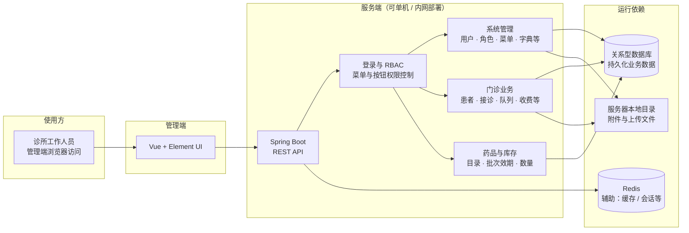

# 🐚 Nautilus Clinic — 海螺诊所管理系统（业务底座）

> 本文档为诊所业务系统（业务底座层）的详细说明。AI Agent 平台整体介绍见 [根目录 README](../README.md)。

---

## 项目概述

**Nautilus Clinic** 是一套面向小型私立诊所的全流程信息化管理系统，涵盖患者建档、问诊记录、处方开具、药品库存四大核心业务，并集成了 AI 辅助问诊、NLP 处方解析、RAG 知识检索等智能能力。

在本 AI Agent 平台中，Nautilus Clinic 作为**医疗行业业务底座**，其药品库存、患者档案、就诊记录、收费账单等业务能力通过 MCP 网关统一封装为标准化工具，供上层 Agent 安全调用。

系统在数据层面做出了关键设计取舍：将患者的**动态体征、自定义标签、过敏史**等非结构化信息存储为 PostgreSQL **JSONB** 字段，同时将**处方明细**序列化为 JSONB 数组，从而避免了繁琐的宽表设计，并充分利用 PostgreSQL 原生 JSONB 函数实现毫秒级深度检索。

---

## 架构（私有化部署示意）

以下为 **单体、可私有化部署** 的管理端形态示意：工作人员通过浏览器访问前端，请求进入 Spring Boot；认证与 RBAC（菜单与按钮权限控制）通过后，再进入系统管理或门诊、库存等业务模块。数据持久化在关系型数据库，附件落在服务器本地目录；Redis 用于常见缓存或会话等辅助能力，非独立业务中台。



---

## 技术栈

| 层次 | 技术 | 版本 |
|---|---|---|
| 后端框架 | Spring Boot | 3.x |
| ORM | MyBatis-Plus | 3.5+ |
| 数据库 | **PostgreSQL**（JSONB 核心） | 12+ |
| 缓存 | Redis（可选） | — |
| 权限 | Spring Security + JWT | 6.x |
| 低代码 | Magic API | 2.2.2 |
| 定时任务 | Quartz | 2.5.2 |
| 前端 | Vue 3 + Element Plus | — |
| 构建 | Maven | 3.6+ |

---

## 系统功能

### 1. 患者档案管理

- **基础信息**：姓名、性别、出生日期、年龄、科别、联系方式
- **动态档案（JSONB）**：血型、过敏史、自定义标签、历次体征记录（血压、心率等）
- 支持按姓名模糊检索、按 JSONB 字段深度检索（见下方专项介绍）

### 2. 就诊记录管理

- 关联患者→问诊单→处方的完整就诊链
- 主诉、诊断结果自由文本录入
- **处方明细以 JSONB 数组存储**，每条记录包含药品名、规格、数量、用法等结构化字段
- 就诊单状态流转：`已开具 → 已发药`
- 支持 NLP 自然语言处方解析（`你好，开阿莫西林两盒` → 自动结构化）

### 3. 药品库存管理

- 药品基本信息（名称、规格、单位、库存量、进价/售价）
- **扩展属性（JSONB）**：存储不同药品的特有属性，例如冷藏标记、批号、效期等
- 自动库存扣减：发药时触发库存核减

### 4. AI 与 RAG 能力

- **NLP 处方解析**：使用正则 + 语义规则将自然语言转成结构化处方对象
- **RAG 知识检索**：基于 pgvector + Spring AI，支持向量相似度搜索临床知识库
- OpenAI 兼容接口，支持国内大模型（自定义 base-url）

### 5. 系统能力（继承自 RuoYi-Pro）

| 功能 | 说明 |
|---|---|
| 用户/角色/权限 | RBAC 三级权限体系 |
| 操作日志 | 全链路审计日志 |
| 代码生成 | MyBatis-Plus 适配模板 |
| 三级等保 | 密码周期、失败锁定、IP 黑名单 |
| 多数据库 | MySQL / PostgreSQL / 达梦 / 瀚高 / 高斯 |

---

## JSONB 检索专项介绍 ⭐

这是本业务系统最具技术亮点的模块。相比传统的关系型扩展表，JSONB 方案让**动态、不规则的医疗数据**无需改表结构即可灵活扩展，同时借助 PostgreSQL 原生函数实现高性能检索。

### 数据模型设计

#### 患者动态档案 `dynamic_profile`

```sql
-- 患者表核心字段
CREATE TABLE nautilus_patient (
    patient_id   BIGINT PRIMARY KEY,
    patient_name VARCHAR(64),
    gender       CHAR(1),
    birth_date   DATE,
    -- 动态档案，所有非结构化字段存入此列
    dynamic_profile JSONB
);
```

**`dynamic_profile` 示例数据：**

```json
{
  "bloodType":  "A+",
  "tags":       ["Yorushika铁粉", "高血压", "长期随访"],
  "allergies":  ["青霉素", "春泥", "花粉"],
  "vitals": [
    { "date": "2025-12-01", "bp": "120/80", "hr": 72 },
    { "date": "2026-01-15", "bp": "135/88", "hr": 78 }
  ]
}
```

#### 处方明细 `prescription_payload`

```sql
-- 就诊记录表
CREATE TABLE nautilus_consultation (
    consultation_id    BIGINT PRIMARY KEY,
    patient_id         BIGINT,
    chief_complaint    TEXT,
    diagnosis          TEXT,
    status             CHAR(1),
    -- 处方明细列表，避免宽表设计
    prescription_payload JSONB
);
```

**`prescription_payload` 示例数据：**

```json
[
  {
    "medicineName": "阿莫西林胶囊",
    "spec":         "0.5g×24粒",
    "quantity":     2,
    "unit":         "盒",
    "dosage":       "每日三次，每次两粒",
    "unitPrice":    8.50
  },
  {
    "medicineName": "布洛芬缓释胶囊",
    "spec":         "0.3g×20粒",
    "quantity":     1,
    "unit":         "盒",
    "dosage":       "每日两次，每次一粒",
    "unitPrice":    12.00
  }
]
```

---

### JSONB 检索实现

#### Java 实体映射

通过 MyBatis-Plus 的 `JacksonTypeHandler` 实现 JSONB ↔ Java 对象的自动双向序列化：

```java
@TableName(value = "ruoyi.nautilus_patient", autoResultMap = true)
public class NautilusPatient extends BaseEntity {

    // 动态档案：自动序列化/反序列化为 Map<String, Object>
    @TableField(typeHandler = JacksonTypeHandler.class)
    private Map<String, Object> dynamicProfile;
}

@TableName(value = "ruoyi.nautilus_consultation", autoResultMap = true)
public class NautilusConsultation extends BaseEntity {

    // 处方明细：自动序列化/反序列化为 List<Map<String, Object>>
    @TableField(typeHandler = JacksonTypeHandler.class)
    private List<Map<String, Object>> prescriptionPayload;
}
```

#### 核心检索逻辑

使用 `jsonb_exists()` PostgreSQL 原生函数，可以直接检索 JSONB 数组内的成员，无需 `LIKE` 或全表扫描：

```java
@Override
public List<NautilusPatient> advancedSearch(String tag, String allergy) {
    LambdaQueryWrapper<NautilusPatient> wrapper = new LambdaQueryWrapper<>();

    if (StringUtils.isNotEmpty(tag)) {
        // 检索 tags 数组中是否包含指定标签
        // 使用 {0} 占位符而非 ? 避免与 JDBC 占位符冲突
        wrapper.apply("jsonb_exists(dynamic_profile->'tags', {0})", tag);
    }

    if (StringUtils.isNotEmpty(allergy)) {
        // 检索 allergies 数组中是否包含指定过敏源
        wrapper.apply("jsonb_exists(dynamic_profile->'allergies', {0})", allergy);
    }

    return this.list(wrapper);
}
```

**生成的 SQL（以标签检索为例）：**

```sql
SELECT *
FROM ruoyi.nautilus_patient
WHERE jsonb_exists(dynamic_profile->'tags', 'Yorushika铁粉')
  AND jsonb_exists(dynamic_profile->'allergies', '青霉素');
```

#### API 接口

```http
GET /clinic/patient/advanced-search?tag=Yorushika铁粉&allergy=青霉素
Authorization: Bearer <token>
```

**响应示例：**

```json
{
  "code": 200,
  "msg": "查询成功",
  "rows": [
    {
      "patientId": "1763820471234560001",
      "patientName": "Amy",
      "gender": "F",
      "dynamicProfile": {
        "bloodType": "A+",
        "tags": ["Yorushika铁粉", "高血压"],
        "allergies": ["青霉素", "春泥"]
      }
    }
  ],
  "total": 1
}
```

#### 为什么使用 `jsonb_exists` 而非 `@>` 操作符？

| 方案 | SQL 示例 | 问题 |
|---|---|---|
| `@>` 包含操作符 | `dynamic_profile->'tags' @> '["Yorushika铁粉"]'` | 需要 JDBC `?` 占位符，与 MyBatis-Plus `wrapper.apply()` 的 `?` 冲突 |
| `jsonb_exists()` ✅ | `jsonb_exists(dynamic_profile->'tags', ?)` | 支持 MyBatis-Plus `{0}` 占位符，安全规避冲突 |

> **结论**：使用 `jsonb_exists(col->'key', {0})` 配合 MyBatis-Plus `wrapper.apply()` 是在 ORM 层安全使用 JSONB 检索的最佳实践。

#### 性能优化建议

如需在大数据量下保持高性能，可对 `dynamic_profile` 添加 GIN 索引：

```sql
-- 为 dynamic_profile 整列创建 GIN 索引（支持所有 key 的检索）
CREATE INDEX idx_patient_dynamic_profile
    ON ruoyi.nautilus_patient
    USING GIN (dynamic_profile jsonb_path_ops);

-- 仅对 tags 数组建立 GIN 索引（更精细）
CREATE INDEX idx_patient_tags
    ON ruoyi.nautilus_patient
    USING GIN ((dynamic_profile->'tags'));
```

---

## 本地启动（业务底座单独调试）

> 日常开发请优先使用平台统一容器化启动方式，见 [Docker 容器化开发规范](./DOCKER.md)。以下为业务底座单独调试时的裸机启动说明。

### 环境要求

| 依赖 | 版本 |
|---|---|
| JDK | 17 或 21 |
| PostgreSQL | 12+（必须，需支持 JSONB） |
| Redis | 可选 |
| Maven | 3.6+ |
| Node.js | 16+（前端） |

### 1. 初始化数据库

```bash
# 创建数据库
psql -U postgres -c "CREATE DATABASE nautilus_clinic;"

# 导入系统基础表（RuoYi 系统表）
psql -U postgres -d nautilus_clinic < sql/ruoyi-pgsql.sql
psql -U postgres -d nautilus_clinic < sql/magic-api-pgsql.sql

# 导入诊所业务表（patients, consultations, inventory 等）
psql -U postgres -d nautilus_clinic < sql/clinic-pgsql.sql
```

### 2. 修改配置

编辑 `ruoyi-admin/src/main/resources/application.yml`，选择 profile：

```yaml
spring:
  profiles:
    active: devpg   # 使用 PostgreSQL 开发配置
```

编辑 `application-devpg.yml`，填入你的数据库凭据（禁止硬编码，统一环境变量托管）。

同时修改 `application.yml` 中的 JWT 密钥（至少 32 位随机强密钥）。

### 3. 编译启动后端

```bash
mvn clean package -DskipTests
java -jar ruoyi-admin/target/ruoyi-admin.jar
```

### 4. 启动前端

```bash
cd ruoyi-ui
npm install
npm run dev
```

### 5. 访问系统

| 地址 | 说明 |
|---|---|
| `http://localhost:80` | 前端界面 |
| `http://localhost:8087/doc.html` | Springdoc 接口文档 |
| `http://localhost:8087/magic/web` | Magic API 低代码平台 |

> 首次登录使用系统管理员账号，**请立即修改默认密码**。

---

## 业务底座 API 摘要

启动后访问 `http://localhost:8087/doc.html`，主要接口如下：

| 接口 | 方法 | 说明 |
|---|---|---|
| `/clinic/patient/list` | GET | 患者列表（支持姓名模糊查询） |
| `/clinic/patient/{id}` | GET | 患者详情（含 dynamicProfile JSONB） |
| `/clinic/patient/advanced-search` | GET | **JSONB 深度检索**（标签 + 过敏源） |
| `/clinic/patient` | POST | 新增患者 |
| `/clinic/consultation/list` | GET | 就诊记录列表 |
| `/clinic/consultation/quick` | POST | 快速问诊（一次性创建患者+就诊记录） |
| `/clinic/inventory/list` | GET | 药品库存列表 |

---

## 开源协议

本项目基于 [MIT License](../LICENSE) 开源。业务系统在 [若依 RuoYi](https://gitee.com/y_project/RuoYi-Vue) 开源生态基础上二次开发，遵循相应开源协议。
